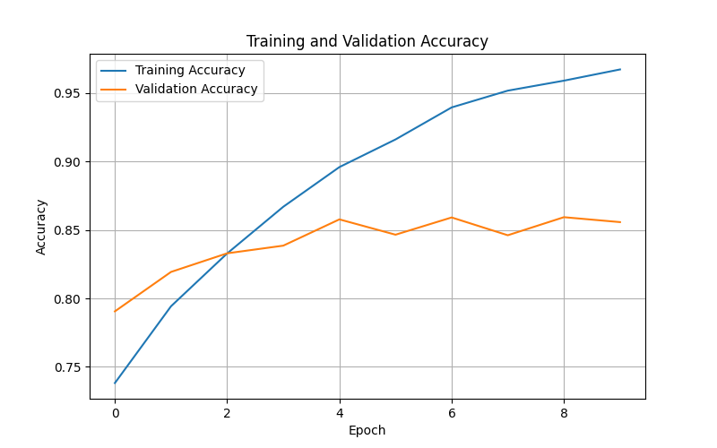
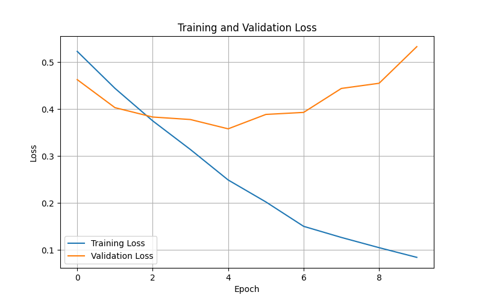
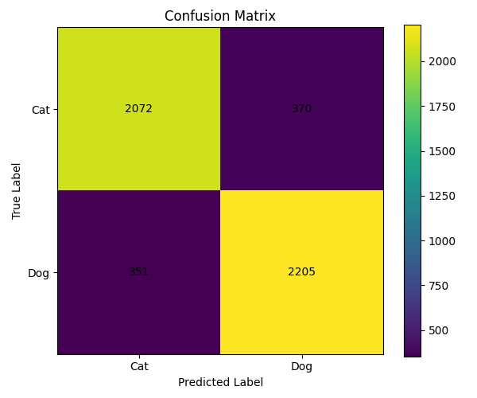
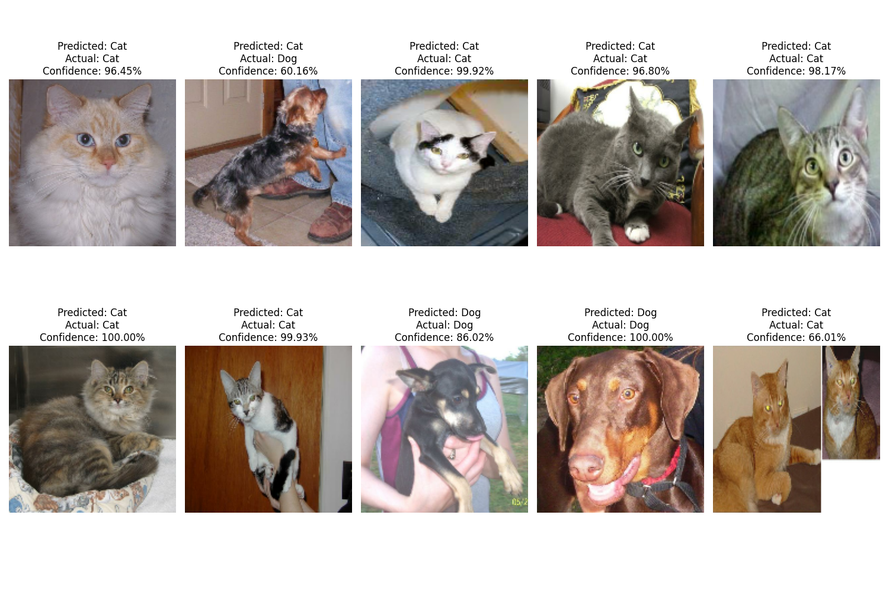

# 🐱🐶 Cats vs Dogs Image Classification

## 📌 Project Overview

This project is part of the **B.Y.T.E. AVIP 2026 AI/ML Internship**.

The objective of this task is to build a deep learning image classification model that can automatically distinguish between **cats and dogs** from images.

A Convolutional Neural Network (CNN) was developed using **TensorFlow/Keras** and trained on the Microsoft Cats and Dogs dataset.

---

## 🎯 Objective

The main objectives of this project are to:

- Build an image classification model for cats and dogs.
- Preprocess and clean the image dataset.
- Train a CNN model using TensorFlow/Keras.
- Evaluate the model using test-set metrics.
- Generate a confusion matrix and classification report.
- Test the model on sample images.
- Save the trained model for future inference.

---

## 📂 Dataset

The project uses the **Microsoft Cats and Dogs Dataset**.

The dataset contains images belonging to two classes:

- 🐱 Cat
- 🐶 Dog

Before training, corrupted or unreadable images were identified and removed.

---

## ⚙️ Data Preprocessing

The following preprocessing steps were applied:

- Corrupted images were removed.
- Images were resized to **150 × 150 pixels**.
- The dataset was divided into:
  - **80% training data**
  - **20% test/validation data**
- Images were processed in batches of **32**.
- Pixel values were normalized to the range **0–1** using a Rescaling layer.

---

## 🧠 Model Architecture

A Convolutional Neural Network (CNN) was implemented using TensorFlow/Keras.

The model consists of:

1. Rescaling layer
2. Convolutional layer — 32 filters
3. Max Pooling layer
4. Convolutional layer — 64 filters
5. Max Pooling layer
6. Convolutional layer — 128 filters
7. Max Pooling layer
8. Flatten layer
9. Dense layer — 128 neurons
10. Dropout layer — 0.5
11. Output layer with sigmoid activation

The output layer produces a probability used to classify an image as either a cat or a dog.

---

## 🏋️ Training

The model was trained for **10 epochs**.

### Training Configuration

| Parameter | Value |
|---|---|
| Framework | TensorFlow / Keras |
| Model | Convolutional Neural Network |
| Image Size | 150 × 150 |
| Batch Size | 32 |
| Epochs | 10 |
| Optimizer | Adam |
| Loss Function | Binary Crossentropy |
| Output Activation | Sigmoid |

---

## 📊 Results

The trained model was evaluated on the test dataset.

### Test Performance

- **Test Accuracy:** 85.57%
- **Test Loss:** 0.5332

### Accuracy Graph



### Loss Graph



---

## 📈 Confusion Matrix

The confusion matrix was generated to analyze the model's classification performance for both classes.



---

## 🔍 Sample Predictions

The model was tested on 10 sample images from the test dataset.

Each sample includes:

- Predicted class
- Actual/ground-truth class
- Prediction confidence



---

## 💾 Saved Model

The trained model is provided in the repository as:

```text
cats_vs_dogs_model.keras# AI_ML_1_Cats_vs_Dogs_BYTE
# Cats vs Dogs Image Classification

## Objective
Build a deep learning image classification model that can distinguish between cats and dogs.

## Dataset
Microsoft Cats and Dogs Dataset.

## Preprocessing
- Removed corrupted images
- Resized images to 150x150 pixels
- Used an 80/20 training-validation split
- Pixel values were normalized to 0-1

## Model
A Convolutional Neural Network (CNN) was developed using TensorFlow/Keras.

The model includes:
- Rescaling layer
- 3 Convolutional layers
- Max Pooling layers
- Flatten layer
- Dense layer
- Dropout
- Sigmoid output layer

## Training
The model was trained for 10 epochs using:
- Optimizer: Adam
- Loss: Binary Crossentropy
- Batch size: 32

## Results
Test accuracy: [YOUR TEST ACCURACY HERE]

## Evaluation
The project includes:
- Training/validation accuracy graph
- Training/validation loss graph
- Confusion matrix
- Classification report
- 10 sample predictions with ground-truth labels

## Model File
The trained model is provided as:

`cats_vs_dogs_model.keras`

## Inference
The saved model can be loaded using TensorFlow/Keras and used to classify new cat and dog images.
